# 🏦 FinWithDip – AI Default Risk Assessment Platform


> **IDBI Innovate 2026 | Problem Statement 4 – Default Prediction Model**

FinWithDip is an AI-powered credit risk assessment platform developed for **IDBI Innovate 2026**. The platform demonstrates an intelligent **Probability of Default (PD)** assessment workflow by combining Machine Learning, Banking Governance Rules, Explainable AI, Interactive Analytics, and Enterprise Risk Reporting to support early credit risk identification.

---

# 🚀 Live Demo

🌐 **Application:**  
https://finwithdipidbi.streamlit.app/

---

# 📂 GitHub Repository

🔗 https://github.com/IamDip-SK10/IDBI_HACKATHON

---

# ✨ Key Features

- 🤖 AI-based Probability of Default (PD) Prediction
- 🏦 Banking Governance Rule Engine
- 🔍 Explainable AI Decision Breakdown
- 📊 Debt-to-Income (DTI) Analysis
- 🏠 Loan-to-Value (LTV) Analysis
- 🚦 Risk Band Classification
- ⚠ Early Warning Risk Indicators
- 💡 Strategic Risk Mitigation Recommendations
- 📈 Interactive Analytics Dashboard
- 📄 Enterprise PDF Risk Assessment Report
- 🎯 Professional Streamlit Interface

---

# 🏗️ Project Workflow

```
Applicant Details
        │
        ▼
Machine Learning Prediction
        │
        ▼
Banking Governance Validation
        │
        ▼
Explainable AI Analysis
        │
        ▼
Risk Analytics Dashboard
        │
        ▼
Strategic Recommendations
        │
        ▼
Enterprise PDF Report
```

---

# 🛠️ Technology Stack

- Python
- Streamlit
- Scikit-learn
- Pandas
- NumPy
- Matplotlib
- ReportLab
- Git
- GitHub

---

# 📸 Project Screenshots

## 🏠 Home & Platform Overview

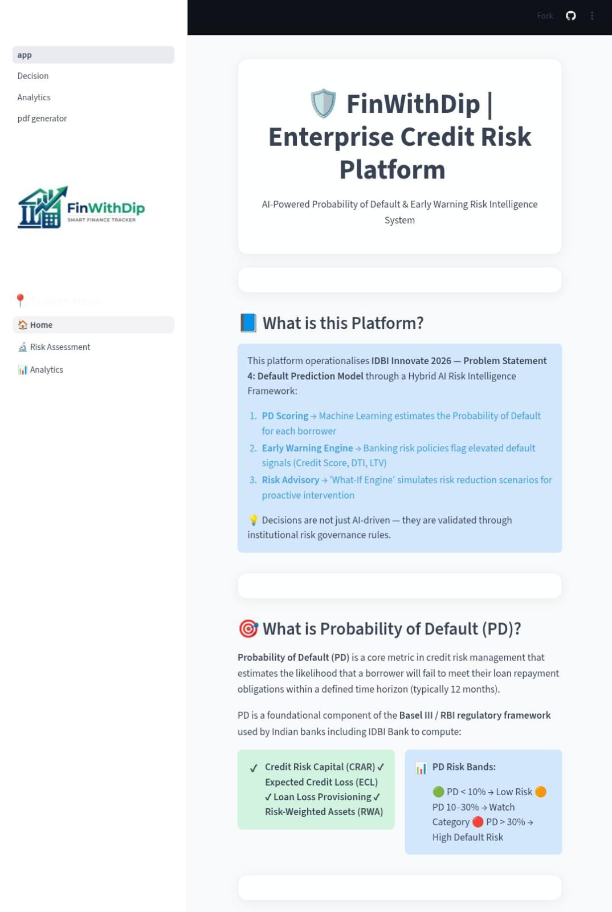

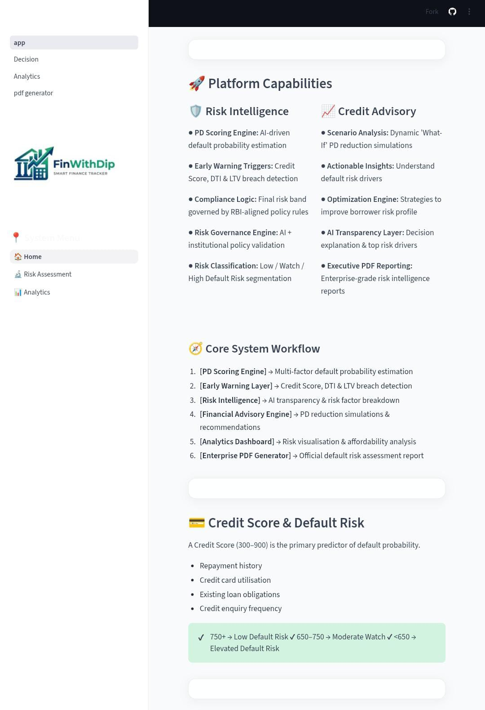

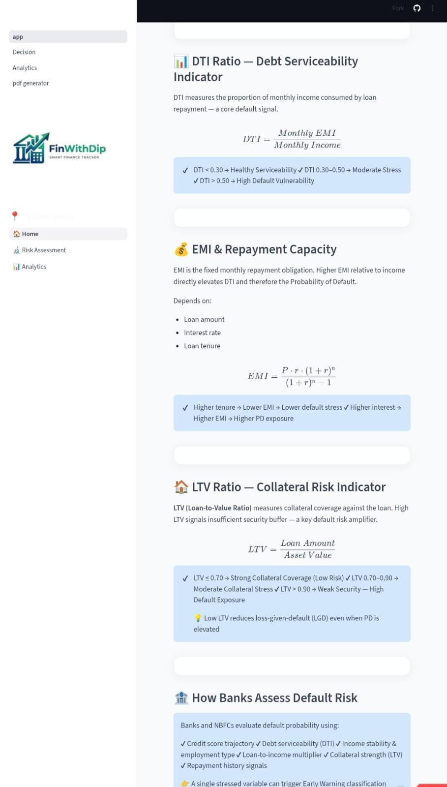

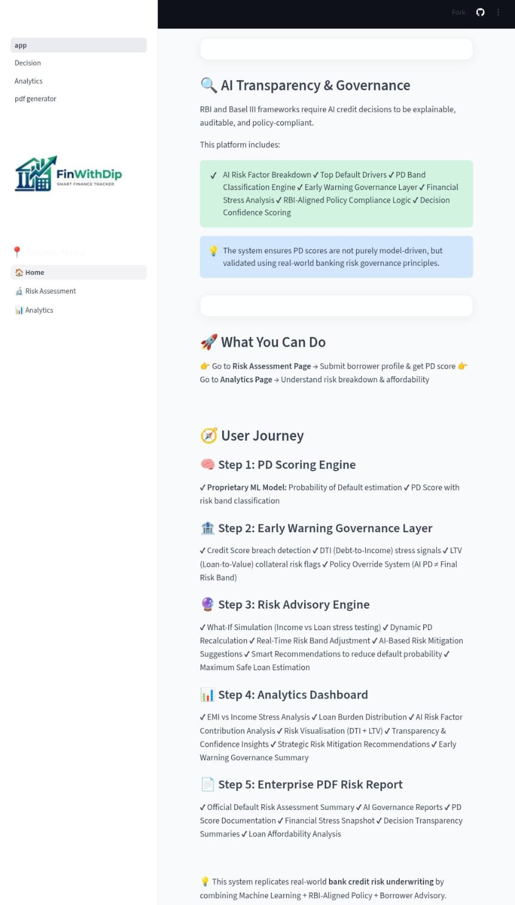

---

## 🧠 Risk Assessment Module

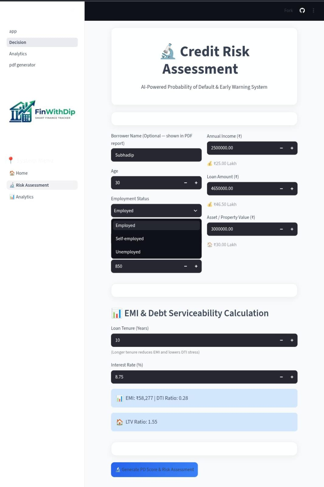

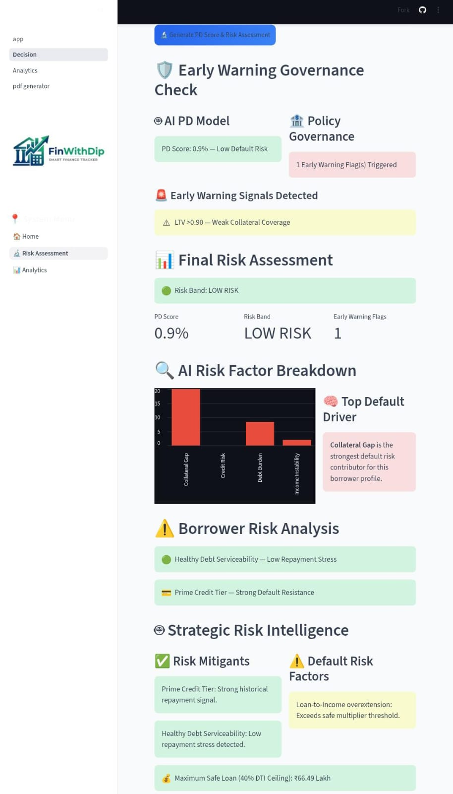

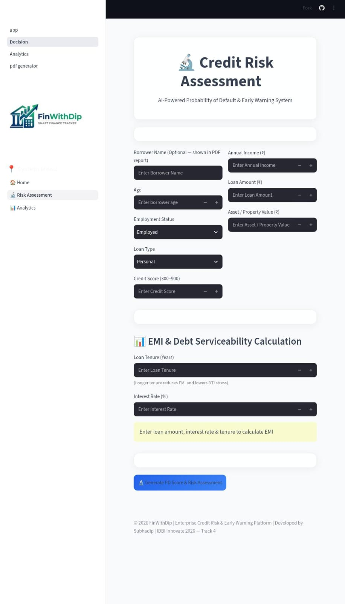

---

## 📊 Analytics Dashboard

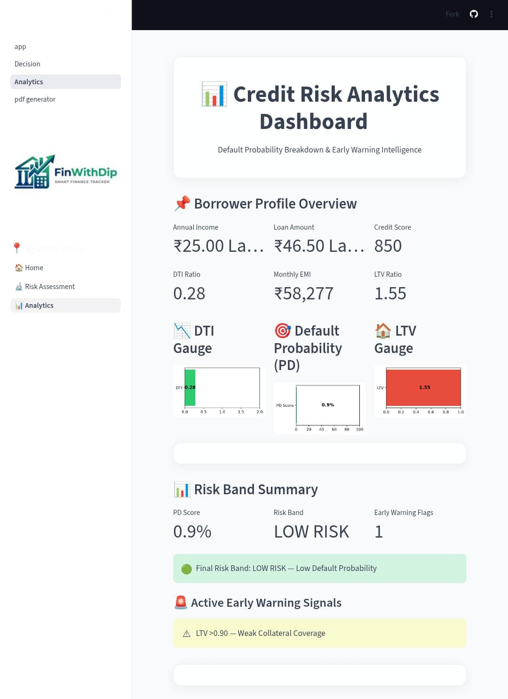

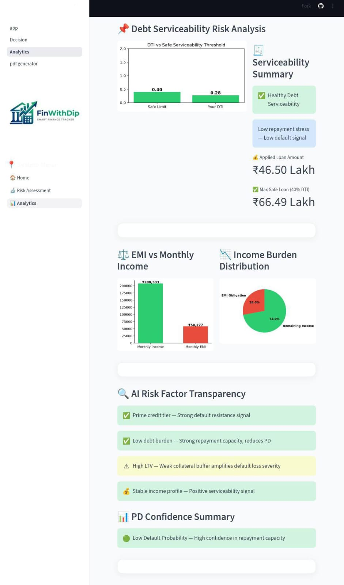

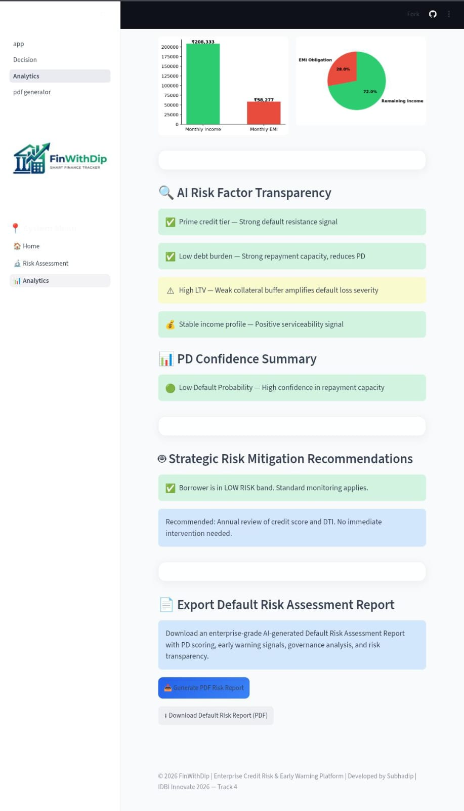

---

## 📄 Enterprise PDF Report

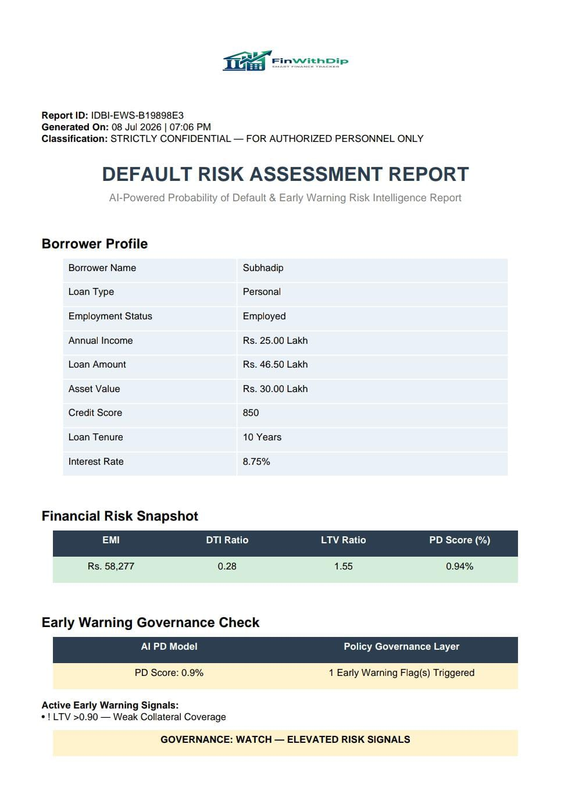

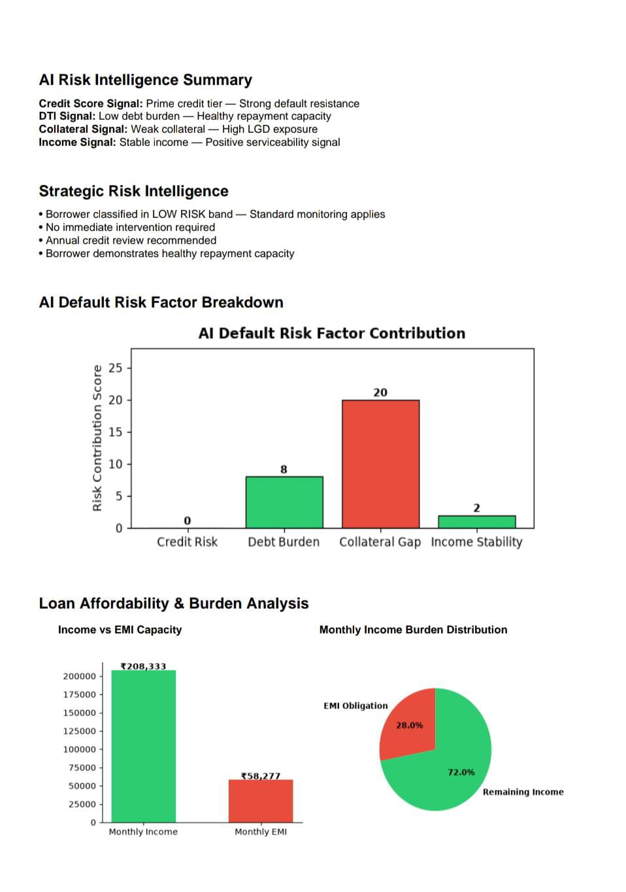

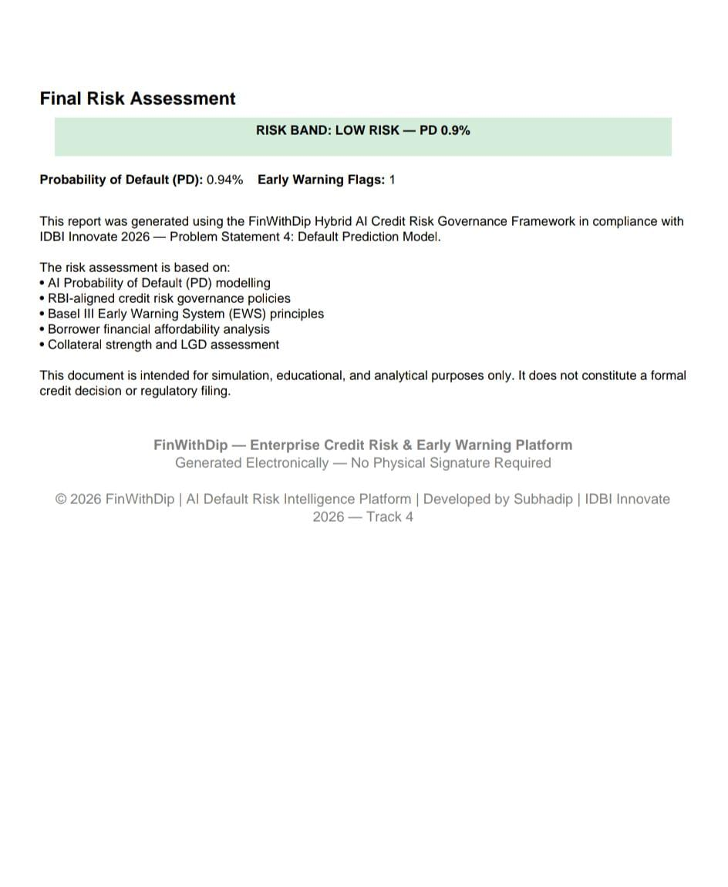

---

# ▶️ Run Locally

```bash
git clone https://github.com/IamDip-SK10/IDBI_HACKATHON.git

cd IDBI_HACKATHON

pip install -r requirements.txt

streamlit run app.py
```

---

# 📌 Hackathon Submission

**Hackathon:** IDBI Innovate 2026

**Problem Statement:** Problem Statement 4 – Default Prediction Model

**Team Name:** FinWithDip AI Labs

**Team Size:** Solo

---

# 👨‍💻 Developer

**Subhadip Kumar**

AI & Data Analytics Enthusiast | Banking Technology | Machine Learning | Streamlit Developer

---

# 📜 License

This repository has been developed solely for educational, research, and hackathon demonstration purposes.

© 2026 Subhadip Kumar | FinWithDip AI Labs
